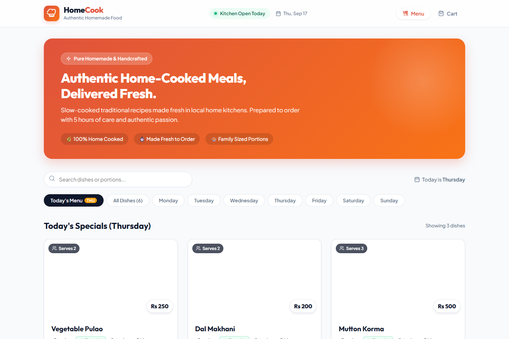
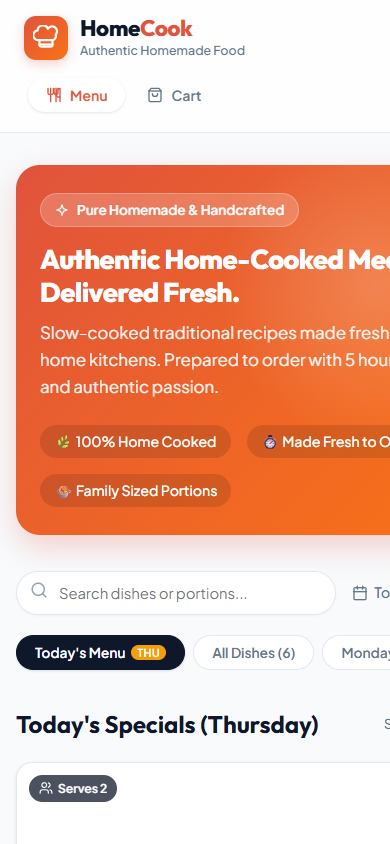
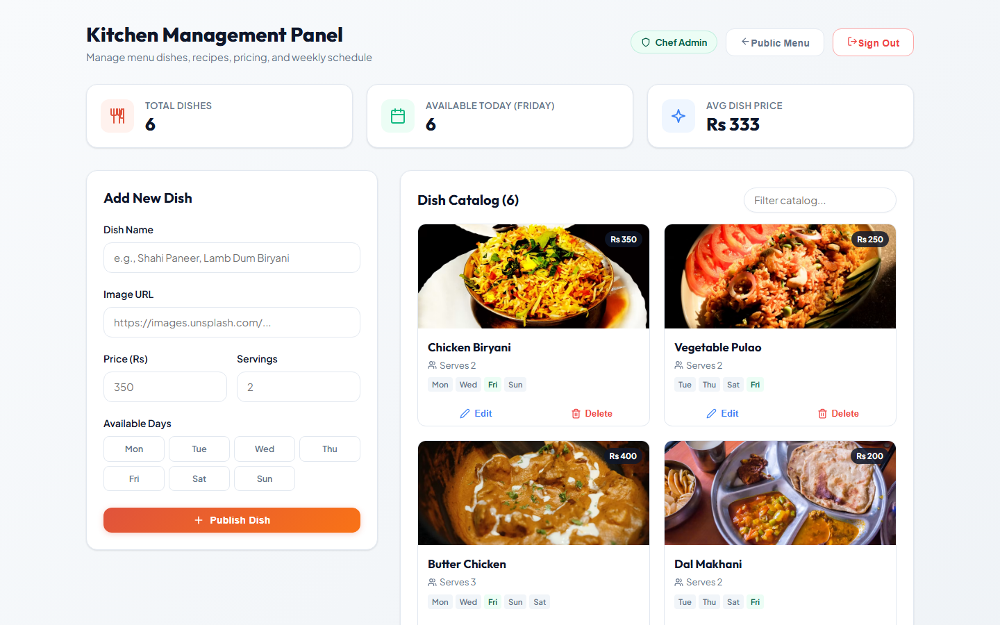

# HomeCook 🍲

> Authentic homemade food delivery platform connecting passionate home chefs with local food lovers, featuring rotating daily menus, 5-hour fresh culinary scheduling, and an authenticated kitchen staff dashboard.

[](https://react.dev/)
[](https://nodejs.org/)
[](https://expressjs.com/)
[](https://www.mongodb.com/)
[](LICENSE)

---

## 📸 Preview

### Desktop Experience


### Mobile & Kitchen Staff Portal
| Mobile Responsive UI | Authenticated Staff Portal |
| :---: | :---: |
|  |  |

---

## ✨ Features

- **🍲 Rotating Daily Menus**: Real-time day detection highlighting today's available dishes with instant preview filters for every day of the week (Monday through Sunday) and full catalog search.
- **⏱️ 5-Hour Fresh Lead-Time Scheduling**: Automated delivery time calculation enforcing a minimum 5-hour lead time to ensure every home-cooked meal is handcrafted fresh from scratch without preservatives.
- **🛒 Interactive Shopping Cart**: Non-intrusive toast notifications, instant quantity adjustments (`+` / `-`), line-item subtotal breakdown, and complimentary delivery calculation.
- **🔐 Authenticated Kitchen Staff Portal (`/admin`)**:
  - Secure login portal segregated from public customer navigation.
  - KPI overview: Total catalog dishes, dishes active today, and average price.
  - Interactive recipe publishing with live image preview box and weekday scheduling chips.
  - Custom modal dialogs for safe dish deletion.
- **🎨 Modern Culinary Design System**:
  - Warm terracotta gradient branding (`#E0533C` to `#F97316`) and emerald freshness badges.
  - Typography powered by Google Fonts (**Outfit** for headings and **Plus Jakarta Sans** for body).
  - 100% lightweight custom SVG icons with zero bulky third-party icon libraries.

---

## 🛠️ Tech Stack

| Layer | Technologies |
| :--- | :--- |
| **Frontend** | React 19, Modern CSS3 (Variables, Glassmorphism, CSS Grid), React Router DOM |
| **Backend** | Node.js (v22+), Express.js 5, CORS, Body-Parser, Dotenv |
| **Database** | MongoDB 8.0 with Mongoose 8 ODM |
| **Design** | Plus Jakarta Sans, Outfit, Custom Inline SVG Icon System |

---

## 🚀 Getting Started

### Prerequisites
Make sure you have the following installed locally:
- [Node.js](https://nodejs.org/) (v18 or higher recommended, tested on Node v22)
- [MongoDB Community Server](https://www.mongodb.com/try/download/community) (v6.0 or higher)
- [Git](https://git-scm.com/)

---

### 1. Clone the Repository
```bash
git clone https://github.com/DevByAbdullah0x/HomeCook.git
cd HomeCook
```

---

### 2. Backend Setup
Navigate to the `backend` directory and install dependencies:
```bash
cd backend
npm install
```

Create a `.env` file based on `.env.example`:
```env
MONGO_URI=mongodb://127.0.0.1:27017/homecook
PORT=5000
ADMIN_USERNAME=admin
ADMIN_PASSWORD=homecook123
```

Start the backend server:
```bash
npm start
```
> The backend server will automatically connect to MongoDB and seed initial handcrafted dishes if the database is empty. The API will listen on `http://localhost:5000`.

---

### 3. Frontend Setup
In a new terminal window, navigate to the `frontend` directory:
```bash
cd frontend
npm install
npm start
```
> The React development server will start at `http://localhost:3000`.

---

## 📡 API Endpoints

### Food Catalog (`/api/foods`)
| Method | Endpoint | Description |
| :--- | :--- | :--- |
| `GET` | `/api/foods?day=Thursday` | Fetch dishes available for a specific day |
| `GET` | `/api/foods/all` | Fetch entire dish catalog |
| `GET` | `/api/foods/:id` | Fetch single dish by ID |
| `POST` | `/api/foods` | Create a new dish *(Admin)* |
| `PUT` | `/api/foods/:id` | Update an existing dish *(Admin)* |
| `DELETE` | `/api/foods/:id` | Remove a dish from the catalog *(Admin)* |

### Orders (`/api/orders`)
| Method | Endpoint | Description |
| :--- | :--- | :--- |
| `POST` | `/api/orders` | Place a new customer order with delivery info |
| `GET` | `/api/orders` | Retrieve list of all orders |
| `GET` | `/api/orders/:id` | Retrieve single order details |

### Authentication (`/api/admin`)
| Method | Endpoint | Description |
| :--- | :--- | :--- |
| `POST` | `/api/admin/login` | Authenticate kitchen staff credentials |
| `GET` | `/api/admin/verify` | Verify active session token |

---

## 🔑 Kitchen Staff Credentials

To access the Kitchen Staff Portal, navigate to `http://localhost:3000/admin` or click the **"Kitchen Staff Portal"** link in the footer:

- **Username**: `admin`
- **Password**: `homecook123`

---

## 📄 License

This project is licensed under the [MIT License](LICENSE) - see the LICENSE file for details.

---

Crafted with ❤️ by [DevByAbdullah0x](https://github.com/DevByAbdullah0x).

